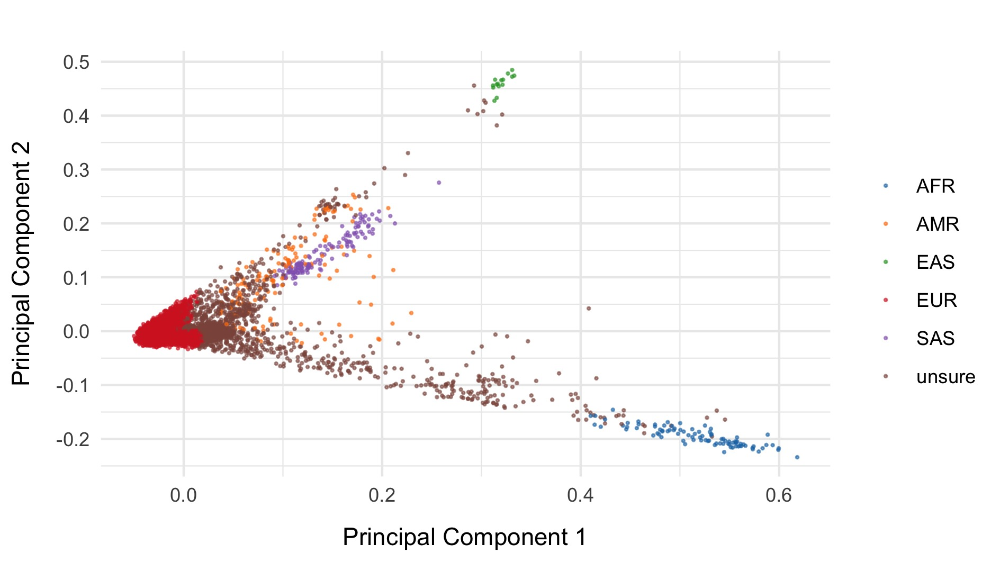
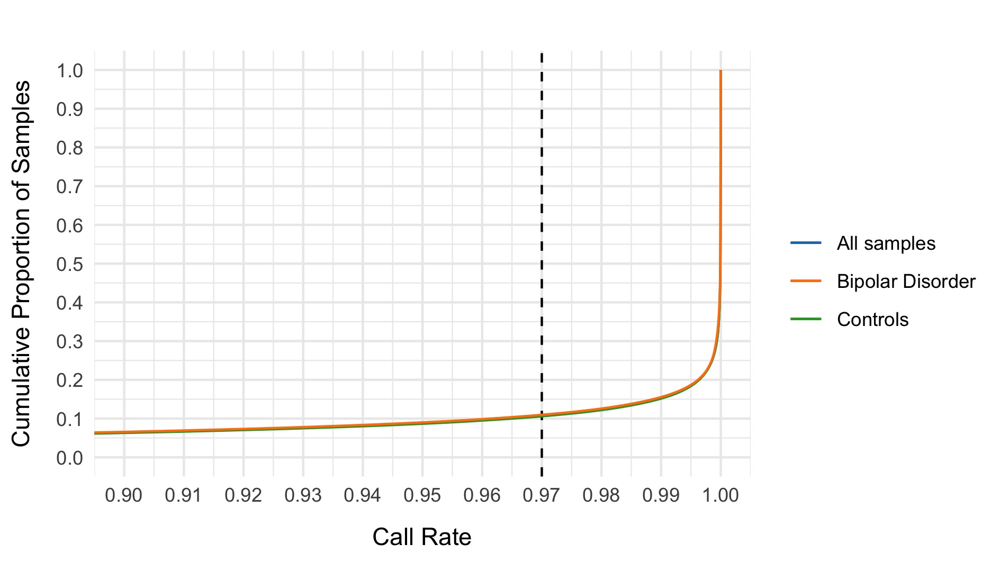
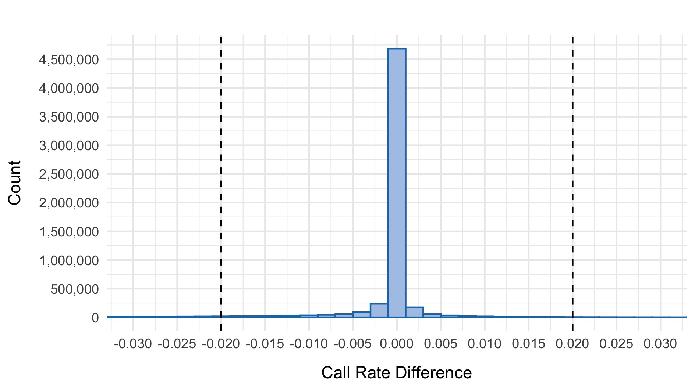
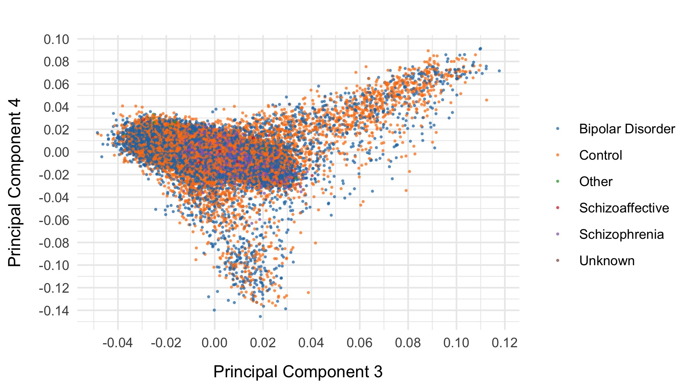

```{r setup, include=FALSE, warning=FALSE}
knitr::opts_chunk$set(echo = TRUE)

require(plotly)
require(crosstalk)
require(data.table)
require(dplyr)
require(DT)
require(kableExtra)
require(formattable)
require(htmltools)
source("../scripts_Dalio/QC_Dalio/r_functions_and_parameters/r_options_Dalio.r")
```

On this page we detail the quality control (QC) pipeline for for the BipEx dataset. Further plots, the underlying [code](https://github.com/astheeggeggs/BipEx/tree/master/scripts_Dalio/QC_Dalio) and a [document](https://github.com/astheeggeggs/BipEx/blob/master/scripts_Dalio/QC_Dalio/QC_pipeline_writeup/pipeline_writeup.tex) summarising the pipeline can be found on the BipEx github [repository](https://github.com/astheeggeggs/BipEx).

We first summarise the collection of samples, splitting across cohorts and subtypes. In addtition to Bipolar cases, we also a collection of Schizophrenia cases that will serve as positive controls for our PTV burden analyses.

```{r sample_composition, echo=FALSE}
dt_pheno <- fread("../phenotype_data/BIP_phenotype_information_cleaned_new_subtype_information_added.tsv")

dt_loc <- dt_pheno %>% group_by(LOCATION) %>% 
    summarize(Controls = sum(PHENOTYPE_COARSE_NEW=="Control"),
                       "Bipolar Disorder" = sum(PHENOTYPE_COARSE_NEW=="Bipolar Disorder"),
                        Schizoaffective = sum(PHENOTYPE_COARSE_NEW=="Schizoaffective"),
                        Schizophrenia = sum(PHENOTYPE_COARSE_NEW=="Schizophrenia"),
                        Other=sum(PHENOTYPE_COARSE_NEW=="Other"),
                        Unknown=sum(PHENOTYPE_COARSE_NEW=="Unknown"),
                        Total=n())
dt_loc <- rbind(dt_loc, c("Total", colSums(dt_loc[,2:ncol(dt_loc)])))

fwrite(dt_loc, file="../phenotype_data/00_phenotypes_and_location_summary.tsv", row.names=FALSE, sep='\t')
dt_loc <- fread("../phenotype_data/00_phenotypes_and_location_summary.tsv")
dt_loc %>%
  kable("html", escape=FALSE, format.args = list(big.mark = ",")) %>% row_spec(0,bold=TRUE) %>%
  row_spec(13, bold = T, color = "white", background = "#f65200") %>%  
  kable_styling('hover')

```

Within the collection of Bipolar cases, we have subtype information: Bipolar 1, and Bipolar 2. Further splitting the cases and labelling Bipolar cases for whom we do not have subtype information available, we obtain the following numbers of samples in each subcategory:

```{r sample_subtype_composition, echo=FALSE}
dt_pheno <- fread("../phenotype_data/BIP_phenotype_information_cleaned_new_subtype_information_added.tsv")

dt_loc <- dt_pheno %>% group_by(LOCATION) %>% 
    summarize(Controls = sum(PHENOTYPE_FINE_NEW=="Control"),
                       "Bipolar Disorder 1" = sum(PHENOTYPE_FINE_NEW=="Bipolar Disorder 1"),
                       "Bipolar Disorder 2" = sum(PHENOTYPE_FINE_NEW=="Bipolar Disorder 2"),
                       "Bipolar Disorder" = sum(PHENOTYPE_FINE_NEW=="Bipolar Disorder"),
                        Schizoaffective = sum(PHENOTYPE_FINE_NEW=="Schizoaffective"))
dt_loc <- rbind(dt_loc, c("Total", colSums(dt_loc[,2:ncol(dt_loc)])))
fwrite(dt_loc, file="../phenotype_data/00_subphenotypes_and_location_summary.tsv", row.names=FALSE, sep='\t')
dt_loc <- fread("../phenotype_data/00_subphenotypes_and_location_summary.tsv")
dt_loc$Total = rowSums(dt_loc[,2:ncol(dt_loc)])

dt_loc %>%
  kable("html", escape=FALSE, format.args = list(big.mark = ",")) %>% row_spec(0,bold=TRUE) %>%
  row_spec(13, bold = T, color = "white", background = "#f65200") %>%  
  kable_styling('hover')

```

For our QC pipeline, we first read in the `.vcf` file, split multiallelics, and remove sites with more than 6 alleles. After splitting muliallelics in the `.vcf` file containing 29,911,479 variants and restricting to these sites, we have 37,344,246 variants.

<br>

# Initial genotype filtering

Our first step (after conversion of the joint called `.vcf` file to a hail matrix table) is to remove genotypes based on the following collection of criteria:

* If homozygous reference, remove if at least one of the following is true:
    + Genotype quality $<$ 20
    + Depth $<$ 10

* If heterozygous, at least one of the following is true:
    + (Reference allele depth + alternative allele depth) divided by total depth $<$ 0.8
    + Alternative allele depth divided by total depth $<$ 0.2
    + Reference phred-scaled genotype posterior $<$ 20
    + Depth $<$ 10

* If homozygous variant, at least one of the following is true:
    + Alternative allele depth divided by total depth $<$ 0.2
    + Reference phred-scaled genotype posterior $<$ 20
    + Depth $<$ 10

<br>

# Initial variant filtering

Remove variants that either:

*  Fall in a low complexity region
*  Fail VQSR
*  Fall outside padded target intervals (50bp padding)
*  Are invariant after the initial GT filter

<br>

```{r variant_table, echo=FALSE}

dt <- fread('gsutil cat gs://dalio_bipolar_w1_w2_hail_02/data/summary_variant_table.tsv', header=FALSE)
names(dt) <- c("Filter", "Variants")
dt <- dt[2:nrow(dt),]
dt <- dt[-6,]
dt[5,1] <- "Invariant sites after initial variant and genotype filters"
dt[5,2] <- dt[5,2] - dt[6,2]
dt[6,1] <- "Variants after initial filter"
dt[,"%"] <- round(100 * dt$Variants/dt$Variants[1], 1)
dt %>% mutate("%" = color_bar("lightgreen")(unlist(dt[,'%']))) %>% 
  kable("html", escape=FALSE, align=c('l', 'r', 'r'), format.args = list(big.mark = ",")) %>% row_spec(0,bold=TRUE) %>%
  row_spec(6, bold = T, color = "white", background = "#f65200") %>% 
  kable_styling('hover')

```

# Initial sample quality control

```{r sample_table_init, echo=FALSE}

dt <- fread('../samples_Dalio/03_initial_sample_count.tsv', header=FALSE)
names(dt) <- c("Filter", "Samples")
dt[,"%"] <- round(100 * dt$Samples/dt$Samples[1], 1)
dt %>% mutate("%" = color_bar("lightgreen")(unlist(dt[,'%']))) %>% 
  kable("html", escape=FALSE, align=c('l', 'r', 'r'), format.args = list(big.mark = ",")) %>% row_spec(0,bold=TRUE) %>%
  row_spec(4, bold = T, color = "white", background = "#f65200") %>% 
  kable_styling('hover')

```

We run the sample_qc function in hail and remove samples according to the following:

* Sample call rate $<$ `r T_sample_callRate`
* FREEMIX contamination (%) $>$ `r T_pct_contamination`
* Percentage chimeras (%) $>$ `r T_pct_chimeras`
* Mean depth $<$ `r T_dpMean`
* Mean genotype quality $<$ `r T_gqMean`

Thresholds used were based on plotting the distributions of these metrics. A full collection of plots can be found in the [repository](https://github.com/astheeggeggs/BipEx/tree/master/QC_plots/sample_plots). Here we show boxplots with overlaid scatterplots of the above metrics, split by sequencing batch, and coloured by location. The threshold for exclusion is shown as a dashed line.

```{r init_samples, echo=FALSE, out.width = '100%'}
knitr::include_graphics("QC_plots/sample_plots/03_callRate_by_batch.jpg")

knitr::include_graphics("QC_plots/sample_plots/03_chimeras_by_batch.jpg")
knitr::include_graphics("QC_plots/sample_plots/03_dpMean_by_batch.jpg")
knitr::include_graphics("QC_plots/sample_plots/03_gqMean_by_batch.jpg")
```

```{r sample_table, echo=FALSE}

dt <- fread('../samples_Dalio/03_sample_count.tsv', header=FALSE)
names(dt) <- c("Filter", "Samples")
dt[,"%"] <- round(100 * dt$Samples/dt$Samples[1], 1)
dt %>% mutate("%" = color_bar("lightgreen")(unlist(dt[,'%']))) %>% 
  kable("html", escape=FALSE, align=c('l', 'r', 'r'), format.args = list(big.mark = ",")) %>% row_spec(0,bold=TRUE) %>%
  row_spec(7, bold = T, color = "white", background = "#f65200") %>% 
  kable_styling('hover')

```

Following this step, we export high quality variants (allele frequency between 0.01 to 0.99 with high call rate (> 0.98)) to plink format and prune to pseudo-independent SNPs using `--indep 50 5 2`. This pruned set of SNPs feeds into the next few stages of the QC pipeline.

<br>

# Sex imputation

We impute the sexes of the individuals with this pruned set of variants on the X chromosome, and create list of samples with incorrect or unknown sex as defined by:

* Sex is unknown in the phenotype files
* F-statistic $>$ `r T_impute_sex` and the sex is female in the phenotype file
* F-statistic $<$ `r T_impute_sex` and the sex is male in the phenotype file

Here we show the distribution of the F-statistic, with the `r T_impute_sex` threshold defining our sex impututation shown as a dashed line.

```{r impute_sex, echo=FALSE, out.width = '100%'}
knitr::include_graphics("QC_plots/sample_plots/05_imputesex_histogram.jpg")
```

```{r sample_sex_removal_table, echo=FALSE}
n_sex_removed <- nrow(fread("../samples_Dalio/05_sexcheck.remove.sample_list", header=FALSE))
n_before_sex_removed <- dt[nrow(dt),2]
n_after_sex_removed <- n_before_sex_removed - n_sex_removed

dt_sex_removal <- rbindlist(
    list(dt[1,],
        list(c("Samples with sex swap", "Samples after sex swap removal"),
             c(n_sex_removed, n_after_sex_removed),
             c(round(n_sex_removed / unlist(dt[1,2]) * 100,1),
               round(n_after_sex_removed / unlist(dt[1,2]) * 100,1)))), use.names=FALSE)

fwrite(dt_sex_removal, file="../samples_Dalio/05_sexcheck_sample_count.tsv", row.names=FALSE, sep='\t')
dt_sex_removal <- fread("../samples_Dalio/05_sexcheck_sample_count.tsv")
dt_sex_removal %>% mutate("%" = color_bar("lightgreen")(unlist(dt_sex_removal[,'%']))) %>% 
  kable("html", escape=FALSE, align=c('l', 'r', 'r'), format.args = list(big.mark = ",")) %>% row_spec(0,bold=TRUE) %>%
  row_spec(3, bold = T, color = "white", background = "#f65200") %>% 
  kable_styling('hover')

```

<br>

# IBD

Using the `identity_by_descent` method in hail, we evaluate $\hat{\pi}$ between pairs of samples, and filter based on a threshold of `r IBD_THRESHOLD` shown as a dashed line on the plot below.

```{r ibd, echo=FALSE, out.width = '100%'}

```

We then create a sample list of patients such that no pair has $\hat{\pi} >$ `r IBD_THRESHOLD`.

```{r sample_ibd_table, echo=FALSE}
n_ibd_removed <- nrow(fread("../samples_Dalio/06_ibd.remove.sample_list", header=FALSE))
n_before_ibd_removed <- dt[nrow(dt),2]
n_after_ibd_removed <- n_before_ibd_removed - n_ibd_removed

dt_ibd_removal <- rbindlist(
    list(dt[1,],
        list(c("Related samples for removal", "Samples after IBD removal"),
             c(n_ibd_removed, n_after_sex_removed),
             c(round(n_ibd_removed / unlist(dt[1,2]) * 100,1),
               round(n_after_ibd_removed / unlist(dt[1,2]) * 100,1)))), use.names=FALSE)

fwrite(dt_ibd_removal, file="../samples_Dalio/06_ibd_sample_count.tsv", row.names=FALSE, sep='\t')
dt_ibd_removal <- fread("../samples_Dalio/06_ibd_sample_count.tsv")
dt_ibd_removal %>% mutate("%" = color_bar("lightgreen")(unlist(dt_ibd_removal[,'%']))) %>% 
  kable("html", escape=FALSE, align=c('l', 'r', 'r'), format.args = list(big.mark = ",")) %>% row_spec(0,bold=TRUE) %>%
  row_spec(3, bold = T, color = "white", background = "#f65200") %>% 
  kable_styling('hover')

```

<br>

# PCA

We next perform a number of principal component analysis (PCA) steps to ensure that we have matched cases and controls in our cleaned dataset. 

<br>

## Initial PCA
We first run PCA on samples after removing relateds and those that passed initial QC, using the
pruned set of variants.

```{r pca, echo=FALSE, out.width = '100%'}

knitr::include_graphics("QC_plots/sample_plots/09_PC3_PC4_collection.jpg")

```

<br>

## PCA including 1000 genomes

Next, we included the 1000 genomes samples (minus the small subset of related individuals within 1000 geneomes), and rerun PCA after including those individuals. Plots of the first six principal components are shown below. 1000 genomes samples are coloured in dark blue.

```{r pca_1kg, echo=FALSE, out.width = '100%'}

knitr::include_graphics("QC_plots/sample_plots/10_PC3_PC4_1kg_collection.jpg")
knitr::include_graphics("QC_plots/sample_plots/10_PC5_PC6_1kg_collection.jpg")
```

We restrict to the European subset of individuals to perform analysis. To do this, we train a random forest on the super populations labels of 1000 genomes and predict the super population that each of the BipEx samples. We denote strictly defined European subset as those with probability $>$ `r T_European_RF` of being European according to the classifier. BipEx samples are coloured by their assignment or unsure if none of the classifier probabilities exceeded `r T_European_RF` in the following plots.

```{r pca_1kg_class_EUR_strict, echo=FALSE, out.width = '100%'}

knitr::include_graphics("QC_plots/sample_plots/10_PC3_PC4_classify_EUR_strict.jpg")
knitr::include_graphics("QC_plots/sample_plots/10_PC5_PC6_classify_EUR_strict.jpg")
```

```{r sample_PC_table, echo=FALSE}

dt <- fread('../samples_Dalio/10_sample_count.tsv', header=FALSE)
names(dt) <- c("Filter", "Samples")
dt[,"%"] <- round(100 * dt$Samples/dt$Samples[1], 1)

dt %>% mutate("%" = color_bar("lightgreen")(unlist(dt[,'%']))) %>% 
  kable("html", escape=FALSE, align=c('l', 'r', 'r'), format.args = list(big.mark = ",")) %>% row_spec(0,bold=TRUE) %>%
  row_spec(4, bold = T, color = "white", background = "#f65200") %>% 
  kable_styling('hover')

```

Samples not assigned to the European cluster were removed from downstream analysis.

In addition, using a much looser definition of European, we restrict to US samples from MGH and Johns Hopkins, and run PCA. This enabled us to identify Ashkenazi Jewish clusters, and create a list of outliers (AJ or otherwise) for downstream removal or independent analysis.

Run also ran a further collection of PCAs on:

* Strictly defined Europeans and Ashkenazi Jewish individuals
    + Use Ashkenazi Jewish cluster to train a random forest and determine if there are further Ashkenazi Jews in the remainder of the dataset.
* Strictly defined Europeans

```{r sample_PC_AJ_table, echo=FALSE}

dt <- fread('../samples_Dalio/10_sample_count.tsv', header=FALSE)
n_AJ <- nrow(fread('../samples_Dalio/12_aj.sample_list', header=FALSE))

names(dt) <- c("Filter", "Samples")
dt <- dt[-c(2,4),]
dt <- rbindlist(list(dt,
    list(c("Ashkenazi Jewish samples", "Samples after loose European filter and AJs removed"),
         c(n_AJ, dt[1,2] - dt[2,2] - n_AJ))))

fwrite(dt, file="../samples_Dalio/12_aj_sample_count.tsv", row.names=FALSE, sep='\t')
dt <- fread("../samples_Dalio/12_aj_sample_count.tsv")

dt[,"%"] <- round(100 * dt$Samples/dt$Samples[1], 1)

dt %>% mutate("%" = color_bar("lightgreen")(unlist(dt[,'%']))) %>% 
  kable("html", escape=FALSE, align=c('l', 'r', 'r'), format.args = list(big.mark = ",")) %>% row_spec(0,bold=TRUE) %>%
  row_spec(4, bold = T, color = "white", background = "#f65200") %>% 
  kable_styling('hover')

```

However, upon restriction to the European cluster and after removal of AJs, we find that we have a dense case-control matched collection of samples and so decide not to analyse Swedes, Finns and Europeans (excluding Finns and Swedes) separately.

<br>

# Final variant filtering

For our final variant filtering step, we first restrict to samples in the strictly defined European subset, filter to the unrelated list, and filter out samples with incorrectly defined sex or unknown sex, and run variant QC. We then evaluate a collection of variant metrics and remove variants that satisfy at least one of:

* Invariant site in cleaned sample subset
* Call rate $<$ `r T_variant_call_rate`
* Control call rate $<$ `r T_variant_call_rate`
* Case call rate $<$ `r T_variant_call_rate`
* $|$Case call rate - Control call rate$| >$ `r T_absdiff`
* $p$-value for Hardy Weinberg Equilibrium $<$ 10<sup>-6</sup>

The following plots show the `r T_variant_call_rate` threshold for call rate and `r T_absdiff` threshold for difference in call rate between cases and controls respectively.

```{r final_variant, echo=FALSE, out.width = '100%'}


```

```{r variant_final_table, echo=FALSE}

dt <- fread('../samples_Dalio/14_variant_count.tsv', header=FALSE)
names(dt) <- c("Filter", "Variants")
dt[,"%"] <- round(100 * dt$Variants/dt$Variants[1], 1)

dt %>% mutate("%" = color_bar("lightgreen")(unlist(dt[,'%']))) %>% 
  kable("html", escape=FALSE, align=c('l', 'r', 'r'), format.args = list(big.mark = ",")) %>% row_spec(0,bold=TRUE) %>%
  row_spec(8, bold = T, color = "white", background = "#f65200") %>% 
  kable_styling('hover')

```

After these steps we plot the resulting changes in metrics across the samples in our data set. Each of the following plots splits the data by sequencing data and colours the points based on location. The first collection of subplots in each figure shows the variant metrics before sample removal, with the lower collection of subplots showing the resultant change after our QC steps.

```{r final_sample, echo=FALSE, out.width = '100%'}


knitr::include_graphics("QC_plots/sample_plots/15_rInsertionDeletionbyBatchColLocation.jpg")

```

<br>

# Final sample filtering

In this step we remove sample outliers after the variant cleaning in the previous step. Samples are removed if at least one of the following lies more that three standard deviations away from the mean:

* Ratio of transitions to transversions
* Ratio of heterozygous to homozygous variant
* Ratio of insertions to deletions
* Number of singletons

```{r variant_sample_table, echo=FALSE}

dt <- fread('../samples_Dalio/15_sample_count.tsv', header=FALSE)
names(dt) <- c("Filter", "Samples")
dt[,"%"] <- round(100 * dt$Samples/dt$Samples[1], 1)

dt %>% mutate("%" = color_bar("lightgreen")(unlist(dt[,'%']))) %>% 
  kable("html", escape=FALSE, align=c('l', 'r', 'r'), format.args = list(big.mark = ",")) %>% row_spec(0,bold=TRUE) %>%
  row_spec(6, bold = T, color = "white", background = "#f65200") %>% 
  kable_styling('hover')

```

As a final step, we export common (allele frequency between 0.01 and 0.99) variants to plink format, prune, and evaluate final principal components for downstream analysis. The first six principal components are displayed below and coloured by case status. 

```{r final_pca, echo=FALSE, out.width = '100%'}
knitr::include_graphics("QC_plots/sample_plots/17_PC1_PC2_final_PCs.jpg")

knitr::include_graphics("QC_plots/sample_plots/17_PC5_PC6_final_PCs.jpg")
```

<br>

After all of this data cleaning, we save the resultant hail matrix tables for downstream analyses.

The resultant composition of the samples was as follows:

```{r final_sample_composition, echo=FALSE}
dt_pheno <- fread("gsutil cat gs://dalio_bipolar_w1_w2_hail_02/data/samples/17_final_qc.samples.tsv.bgz | gzcat")

dt_loc <- dt_pheno %>% group_by(LOCATION) %>% 
    summarize(Controls = sum(PHENOTYPE_COARSE=="Control"),
                       "Bipolar Disorder" = sum(PHENOTYPE_COARSE=="Bipolar Disorder"),
                        Schizoaffective = sum(PHENOTYPE_COARSE=="Schizoaffective"),
                        Schizophrenia = sum(PHENOTYPE_COARSE=="Schizophrenia"),
                        Other=sum(PHENOTYPE_COARSE=="Other"),
                        Unknown=sum(PHENOTYPE_COARSE=="Unknown"),
                        Total=n())
dt_loc <- rbind(dt_loc, c("Total", colSums(dt_loc[,2:ncol(dt_loc)])))

fwrite(dt_loc, file="../phenotype_data/17_phenotypes_and_location_summary.tsv", row.names=FALSE, sep='\t')
dt_loc <- fread("../phenotype_data/17_phenotypes_and_location_summary.tsv")
dt_loc %>%
  kable("html", escape=FALSE, format.args = list(big.mark = ",")) %>% row_spec(0,bold=TRUE) %>%
  row_spec(13, bold = T, color = "white", background = "#f65200") %>%  
  kable_styling('hover')

```

The bipolar subtype information of the curated samples is:

```{r final_sample_subtype_composition, echo=FALSE}
dt_pheno <- fread("gsutil cat gs://dalio_bipolar_w1_w2_hail_02/data/samples/17_final_qc.samples.tsv.bgz | gzcat")


dt_loc <- dt_pheno %>% group_by(LOCATION) %>% 
    summarize(Controls = sum(PHENOTYPE_FINE=="Control"),
                       "Bipolar Disorder 1" = sum(PHENOTYPE_FINE=="Bipolar Disorder 1"),
                       "Bipolar Disorder 2" = sum(PHENOTYPE_FINE=="Bipolar Disorder 2"),
                       "Bipolar Disorder" = sum(PHENOTYPE_FINE=="Bipolar Disorder"),
                        Schizoaffective = sum(PHENOTYPE_FINE=="Schizoaffective"))
dt_loc <- rbind(dt_loc, c("Total", colSums(dt_loc[,2:ncol(dt_loc)])))
fwrite(dt_loc, file="../phenotype_data/17_subphenotypes_and_location_summary.tsv", row.names=FALSE, sep='\t')
dt_loc <- fread("../phenotype_data/17_subphenotypes_and_location_summary.tsv")
dt_loc$Total = rowSums(dt_loc[,2:ncol(dt_loc)])

dt_loc %>%
  kable("html", escape=FALSE, format.args = list(big.mark = ",")) %>% row_spec(0,bold=TRUE) %>%
  row_spec(13, bold = T, color = "white", background = "#f65200") %>%  
  kable_styling('hover')

```


